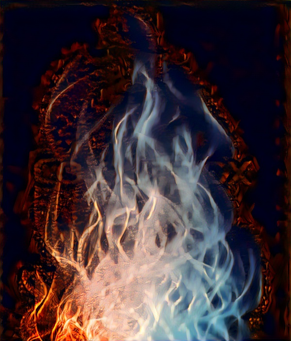

# StyleTransfer
a Style Transfer Command Line Interface

Install 
-------
```bash
pip install torch torchvision
git clone https://github.com/noklam/StyleTransfer.git
```
Demo
-----

Image | Generated
----|-----
| 
 | 


Usage
-----
1. Put your desire content image in image folder
2. Put your desire style image in image folder
3. style content.jpg, style.jpg -s 1

Install PyTorch if you do not have it installed.
I used PyTorch v0.4.1.


CUDA
----
| CUDA Toolkit | NVIDIA (Linux x86_64) |
|--------------|-----------------------|
| CUDA 9.2     | >= 396.26             |
| CUDA 9.0     | >= 384.81             |
| CUDA 8.0     | >= 367.48             |